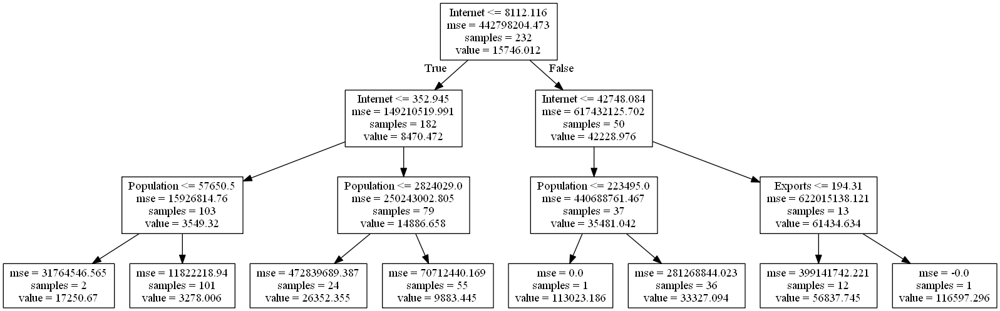

# GDP Machine Learning Model
### Ravi Shankar
### 2/17/22

GDP is an important indicator of economic activity in a nation. GDP is the sum of values (in USD) of good and services produced in a nation during a year, including net exports. The GDP per capita (The GDP of a nation divided by its population) varies significantly among countries of the world, and is a key indicator of standard of living. Here we use nominal GDP, which is not adjusted by the prices in each country.

We want to find a model to see what factors correlate with GDP per capita. 

**Data comes via the World Bank, and the data across all listed countries was taken from 2018** because that was the most complete and recent year.

Worldbank's [GDP](https://data.worldbank.org/indicator/Ny.Gdp.Mktp.Cd) data will be compared with these other indexes:

- [Population](https://data.worldbank.org/indicator/SP.POP.TOTL)
- [Number secure internet servers/ million people](https://data.worldbank.org/indicator/IT.NET.SECR.P6)
- [Exports (as percentage of GDP)](https://data.worldbank.org/indicator/NE.EXP.GNFS.ZS)
- [Imports (as percentage of GDP)](https://data.worldbank.org/indicator/NE.IMP.GNFS.ZS?view=chart)

We will create a [Regression Decision Tree](https://scikit-learn.org/stable/modules/generated/sklearn.tree.DecisionTreeRegressor.html) to see which features best seperate GDP per capita and tease out any trends or relationships between the features. This is an example of explanatory modelling. 

This model will also give us the ability to predict GDP. If there was a hypothetical new country where we knew their population, what percentage of their GDP is imports/exports, and their number of internet servers, then we would have a data-based estimate of what their GDP would be.

# Resulting Model

# Conslusions

The **optimal tree_depth to predict GDP per capita was 3**, as found by 5-fold validation pictured above. At that depth, the prediction MSE was 293,537,383.48, and the **RMSD was $17,132.93.**

It was found that **internet servers per capita was the best feature for seperating GDP per capita.**

After that, population is the feature with the strongest effect on determining GDP per capita.

Also some nodes had only one sample, indicating outliers with unique combinations of statistics. For instance:
- 13 countries had over 42,700 internet servers/ million population, but only one country out of those had exports over 194% of their GDP (**Luxembourg**)
- 37 countries had between 8,112 and 42,748 internet servers/ million population, but only one country out of those had a population less than 223,495 (**Bermuda**)